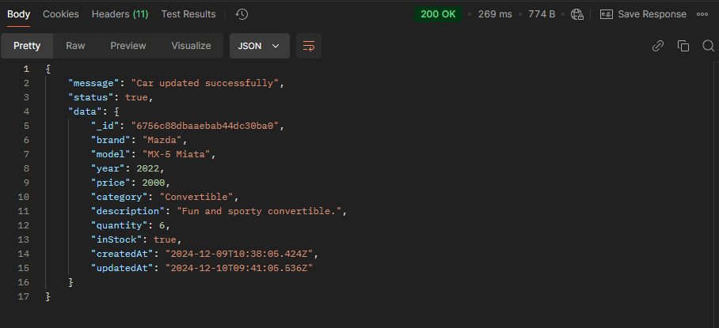

# YourDreamCar

## Live URL

You can access the live application here: [https://2-your-dream-car-backend.vercel.app](https://2-your-dream-car-backend.vercel.app/)

---

## Table of Contents

1. [Introduction](#introduction)
2. [Features](#features)
3. [Technologies Used](#technologies-used)
4. [Setup Instructions](#setup-instructions)
5. [How to Use the Application](#how-to-use-the-application)

---

## Introduction

`YourDreamCar` is a backend project designed for seamless car buying and selling. Users can add cars by providing detailed information, view all listed cars, and perform updates or deletions as needed. Additionally, users can place orders for cars, see total orders, and view the platform's total revenue, ensuring an efficient experience.

---

## Features

- Create, Read, Update and Delete Cars
- Create Order for a car
- See Total Revenue
- Error handling and validation using Zod

---

## Technologies Used

- **Backend Framework:** Express.js
- **Language:** TypeScript
- **Database:** MongoDB with Mongoose
- **Validation:** Zod
- **Others:** Node.js, dotenv, cors, eslint, prettier

---

## Setup Instructions

### Prerequisites

- Node.js
- npm
- MongoDB (local or cloud instance)

### Installation

1. Clone the repository:

```bash
   git clone https://github.com/developer-shourav/YourDreamCar_Backend.git
   cd YourDreamCar_Backend
```


2. Install dependencies:

```bash
npm install
```

3. Set `.env` file into the root directory

 <br/>

You can get the env here: [Visit Here](https://docs.google.com/document/d/16SSu0_09Y8Ur1_6_xXQRDHXuJwx0j9UuFakO-wq8Gok/edit?usp=sharing)

4. Start the development server

```cmd
npm run start:dev
```

## How to Use the Application

### 1. Create a Car
- Endpoint: `/api/cars`
- Method: `POST`

`Request:`  

`Response:`  

### 2. Get All Cars
- Endpoint: `/api/cars`
- Method: `GET`

`Response:`  

### 3. Get a Specific Car
- Endpoint: `/api/cars/:carId`
- Method: `GET`

`Response:`   

### 4. Update a Car
- Endpoint: `/api/cars/:carId`
- Method: `PUT`

`Request:`  

`Response:`  

### 5. Delete a Car
- Endpoint: `/api/cars/:carId`
- Method: `DELETE`

`Response:`  

### 6. Order a Car
- Endpoint: `/api/orders`
- Method: `POST`

`Request:`  

`Response:`  

### 7. Calculate Revenue from Orders (Aggregation)
- Endpoint: `/api/orders/revenue`
- Method: `GET`

`Response:`  


<a href='https://drive.google.com/file/d/1AcWz9tT3ehQerfPaZM-5T6Xm27qKBqDK/view?usp=sharing' target=_blank> </a>
